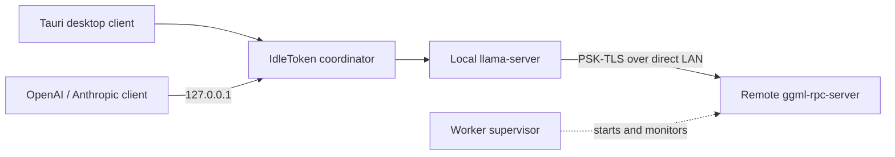

<p align="center">
  <picture>
    <source media="(prefers-color-scheme: dark)" srcset="docs/images/logo-dark.svg">
    
  </picture>
</p>

<h1 align="center">Local llama.cpp inference, on one machine or many.</h1>

<p align="center">
  An open-source Tauri client and runtime for Windows, Linux, and macOS.
</p>

<p align="center">
  <a href="https://github.com/idletoken/IdleToken/releases">Download</a>
  · <a href="#build-from-source">Build from source</a>
  · <a href="README.zh-CN.md">中文</a>
</p>

## Overview

IdleToken packages a pinned, patched llama.cpp engine with a coordinator, worker supervisor, and Tauri desktop client. It runs a curated GGUF model directly on one computer or splits complete layer ranges across a mixed Windows, Linux, and macOS cluster on the same LAN.

The coordinator exposes OpenAI- and Anthropic-compatible APIs on `127.0.0.1`. Single-machine inference drives a local `llama-server` without RPC; cluster inference uses llama.cpp's RPC backend over PSK-TLS.

## Architecture



Core guarantees:

- **Pinned engine.** Every node runs the llama.cpp revision recorded in [`scripts/llamacpp-patches/UPSTREAM`](scripts/llamacpp-patches/UPSTREAM), plus the replayable patches beside it.
- **Single machine without cluster overhead.** Local deployment talks directly to `llama-server`; RPC is used only when multiple machines participate.
- **Mixed-OS clusters with one engine version.** Windows, Linux, and Apple Silicon nodes may mix, but version mismatches are rejected before inference.
- **Local network boundary.** The user-facing API is loopback-only. Embedding lookup and layer 0 stay on the coordinator; tensor traffic uses a direct LAN route, never Tailscale or another overlay, and cluster transport is PSK-TLS protected.
- **Explicit capacity decisions.** The selected 256K or 1M context is a hard input. IdleToken reports insufficient resources instead of silently shrinking the window, switching deployment mode, or falling back to CPU inference.

## Use the local API

After starting a model in the desktop client, discover its model ID:

```sh
curl http://127.0.0.1:8000/v1/models
```

Connect Claude Code:

```sh
export ANTHROPIC_BASE_URL=http://127.0.0.1:8000
export ANTHROPIC_API_KEY=idletoken
claude
```

The local API does not require authentication by default, but clients that require a key may use any non-empty value. OpenAI clients use `/v1/chat/completions`; Anthropic clients use `/v1/messages` and `/v1/messages/count_tokens`.

## Models

IdleToken serves a curated list of GGUF text-generation models. Versioned manifests in [`models/`](models/) define download sources, hashes, quantizations, context capability, and resource metadata; the client verifies weights before use.

Every listed model can run on one machine when it fits or across a cluster when selected. Multimodal models, arbitrary local GGUF files, and unverified architectures are outside the current scope. To propose another model, [open an issue](https://github.com/idletoken/IdleToken/issues).

## Supported hardware

- **Windows 10/11:** NVIDIA GPU with compute capability 7.5 or newer and at least 4 GB VRAM. A current NVIDIA driver is required; release packages include the CUDA runtime DLLs.
- **Linux x86_64:** the same GPU floor, driver 570.26 or newer, and CUDA Toolkit 12.8.
- **Linux arm64:** the same GPU floor, driver 580.65 or newer, and CUDA Toolkit 13.0.
- **macOS:** Apple Silicon with Metal and enough unified memory for the selected model.

CPU-only computers, AMD or Intel GPUs, Intel Macs, and phones may run control surfaces but do not participate in inference. Cluster nodes need a direct LAN route and the same IdleToken engine version.

## Source tree

- `client/` — React/TypeScript frontend and Tauri v2 Rust shell.
- `src/coord/` — scheduler, API adapters, and `llama-server` process supervision.
- `src/worker/` — pairing, resource reporting, and `ggml-rpc-server` supervision.
- `src/common/` and `include/` — shared protocol, planning, model, privacy, and resource code.
- `scripts/llamacpp-patches/` — pinned upstream revision and replayable llama.cpp patches.
- `models/` — curated, versioned model manifests; model weights are never stored in this repository.

## Build from source

Clone the repository first:

```sh
git clone https://github.com/idletoken/IdleToken.git
cd IdleToken
```

### Prerequisites

Frontend-only development needs Node.js with pnpm. A full native build also needs Git, CMake, Rust 1.77 or newer, and the [Tauri v2 system prerequisites](https://tauri.app/start/prerequisites/) for your operating system.

Additional native toolchains:

- **Linux:** a C compiler and the CUDA toolkit version listed under supported hardware.
- **macOS:** Apple Silicon, Xcode Command Line Tools, and CMake.
- **Windows:** Visual Studio 2022 Build Tools with **Desktop development with C++**, Windows SDK, CUDA Toolkit 12.8 with Visual Studio Integration, and WinLibs/MinGW tools providing `gcc` and `windres`. Set `IDLETOKEN_MINGW_BIN` if they are not on `PATH`.

### Frontend-only development

This mode needs no Rust toolchain or GPU. It uses a clearly marked development fixture instead of starting the native engine.

```sh
cd client
pnpm install
pnpm dev
```

Open `http://localhost:1420`.

### Full desktop development on Linux or macOS

```sh
./scripts/build_llamacpp.sh
make
make -f Makefile.platform
./scripts/stage_sidecars.sh
cd client
pnpm install
pnpm tauri dev
```

The engine build is CUDA-only on Linux and Metal-only on macOS. Missing GPU toolchains fail loudly; there is no CPU fallback.

### Build installable packages

The packaging scripts verify that all native sidecars are present and built from the pinned engine. The Linux and macOS release scripts require a clean Git worktree so the resulting package maps to an exact source commit.

Linux (`.deb` and `.rpm`):

```sh
./scripts/build_llamacpp.sh
make IDLETOKEN_PLATFORM_VERIFY_KEY_B64="$(tr -d '\r\n' < scripts/platform-verify-key.b64)"
make -f Makefile.platform
./scripts/build_client_release.sh
```

Artifacts are written below `client/src-tauri/target/release/bundle/`.

macOS (`.dmg`):

```sh
./scripts/build_llamacpp.sh
./scripts/package_client_mac.sh
```

Windows (`.exe`, run from an x64 Native Tools Command Prompt):

```bat
scripts\build_llamacpp_win.bat
cd client
pnpm install
pnpm build:release
cd ..
scripts\build_client_release.bat
```

The Windows installer is written below `client\src-tauri\target\release\bundle\nsis\`. `scripts\build_client_release.bat` rebuilds the coordinator, worker, and platform agent, stages the pinned llama.cpp sidecars and required runtime DLLs, then runs the NSIS bundler.

## Checks

These checks do not require inference hardware:

```sh
scripts/acceptance.sh --gate G_MODEL
python3 scripts/model_manifest_check.py
cd client && npx tsc --noEmit
```

The complete acceptance ladder is implemented by [`scripts/acceptance.sh`](scripts/acceptance.sh). Hardware gates use the machine definitions shown in [`scripts/testbed.env.example`](scripts/testbed.env.example).

## Open-source scope

This repository contains the client, coordinator, worker, engine integration, and reproducible build tooling needed to compile and run IdleToken locally. The hosted marketplace backend is a separate commercial service and is not required for a local single-machine or LAN-cluster deployment.

## Help

For build, installation, pairing, or API problems, search the [existing issues](https://github.com/idletoken/IdleToken/issues) or open one with your OS, IdleToken version, hardware, build command, and the relevant error or log excerpt.

## License

[Apache-2.0](LICENSE). See [NOTICE](NOTICE) for third-party acknowledgements. Contributions are welcome; read [CONTRIBUTING.md](CONTRIBUTING.md) before changing the engine pin, protocol, scheduler, or model registry.
