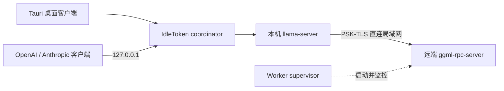

<p align="center">
  <picture>
    <source media="(prefers-color-scheme: dark)" srcset="docs/images/logo-dark.svg">
    
  </picture>
</p>

<h1 align="center">基于 llama.cpp 的本地推理：一台机器或多机集群。</h1>

<p align="center">
  面向 Windows、Linux 与 macOS 的开源 Tauri 客户端和推理运行时。
</p>

<p align="center">
  <a href="https://github.com/idletoken/IdleToken/releases">下载安装包</a>
  · <a href="#从源码构建">从源码构建</a>
  · <a href="README.md">English</a>
</p>

## 项目概览

IdleToken 将钉住版本并应用补丁的 llama.cpp 引擎，与 coordinator、worker supervisor 和 Tauri 桌面客户端打包在一起。它既可以在一台电脑上直接运行精选 GGUF 模型，也可以把完整的连续层切分到同一局域网内由 Windows、Linux 和 macOS 混合组成的集群。

Coordinator 在 `127.0.0.1` 暴露 OpenAI 与 Anthropic 兼容 API。单机推理直接驱动本机 `llama-server`，不经过 RPC；多机推理通过带 PSK-TLS 的 llama.cpp RPC 后端运行。

## 架构



核心约束：

- **钉住推理引擎。** 所有节点都运行 [`scripts/llamacpp-patches/UPSTREAM`](scripts/llamacpp-patches/UPSTREAM) 记录的 llama.cpp revision，并应用同目录下可重放的补丁。
- **单机不承担集群开销。** 单机部署直接调用 `llama-server`，只有多台机器共同推理时才使用 RPC。
- **允许异构系统，不允许引擎版本不同。** Windows、Linux 和 Apple Silicon 节点可以混合组网，版本不一致会在推理开始前被拒绝。
- **本地网络边界。** 用户 API 只监听 loopback；embedding 查表与第 0 层留在 coordinator，张量流量只走可直连的局域网，不经过 Tailscale 等覆盖网络，并使用 PSK-TLS 保护。
- **资源决策明确。** 用户选定的 256K 或 1M 上下文是硬输入。资源不足会明确报错，不会静默缩短窗口、改变部署方式或退回纯 CPU 推理。

## 使用本机 API

在桌面客户端启动模型后，先获取模型 ID：

```sh
curl http://127.0.0.1:8000/v1/models
```

接入 Claude Code：

```sh
export ANTHROPIC_BASE_URL=http://127.0.0.1:8000
export ANTHROPIC_API_KEY=idletoken
claude
```

本机 API 默认不要求鉴权；若客户端必须填写 key，可使用任意非空值。OpenAI 客户端使用 `/v1/chat/completions`，Anthropic 客户端使用 `/v1/messages` 与 `/v1/messages/count_tokens`。

## 模型

IdleToken 只提供精选的 GGUF 文本生成模型。[`models/`](models/) 中的版本化 manifest 定义下载源、哈希、量化精度、上下文能力和资源元数据；客户端会在使用前校验权重。

每个入列模型在单机装得下时均可直接运行，也可由用户选择集群部署。多模态模型、任意本地 GGUF 文件和未经验证的架构不在当前范围内。需要其它模型时，请[提交 issue](https://github.com/idletoken/IdleToken/issues)。

## 支持的硬件

- **Windows 10/11：** NVIDIA GPU，计算能力不低于 7.5，显存至少 4 GB。需要当前 NVIDIA 驱动；发布包已包含 CUDA 运行时 DLL。
- **Linux x86_64：** 显卡门槛相同，需要不低于 570.26 的驱动和 CUDA Toolkit 12.8。
- **Linux arm64：** 显卡门槛相同，需要不低于 580.65 的驱动和 CUDA Toolkit 13.0。
- **macOS：** Apple Silicon，支持 Metal，统一内存足以容纳所选模型。

纯 CPU 电脑、AMD / Intel GPU、Intel Mac 与手机可作为控制端，但不参与推理。集群节点之间必须能通过局域网直连，并运行相同的 IdleToken 引擎版本。

## 源码结构

- `client/`——React/TypeScript 前端与 Tauri v2 Rust shell。
- `src/coord/`——调度器、API adapter 与 `llama-server` 进程监督。
- `src/worker/`——配对、资源上报与 `ggml-rpc-server` 进程监督。
- `src/common/` 和 `include/`——共享协议、规划器、模型、隐私与资源代码。
- `scripts/llamacpp-patches/`——钉住的上游 revision 与可重放的 llama.cpp 补丁。
- `models/`——精选且版本化的模型 manifest；本仓库不存放模型权重。

## 从源码构建

先克隆仓库：

```sh
git clone https://github.com/idletoken/IdleToken.git
cd IdleToken
```

### 前置依赖

只调试前端需要 Node.js + pnpm。完整原生构建还需要 Git、CMake、Rust 1.77 或更新版本，以及当前操作系统对应的 [Tauri v2 系统依赖](https://tauri.app/start/prerequisites/)。

各平台还需要：

- **Linux：** C 编译器，以及“支持的硬件”中对应架构的 CUDA Toolkit。
- **macOS：** Apple Silicon、Xcode Command Line Tools 与 CMake。
- **Windows：** Visual Studio 2022 Build Tools（勾选 **Desktop development with C++**）、Windows SDK、带 Visual Studio Integration 的 CUDA Toolkit 12.8，以及提供 `gcc` 和 `windres` 的 WinLibs/MinGW。若相关工具不在 `PATH`，请设置 `IDLETOKEN_MINGW_BIN`。

### 只调试前端

这种方式不需要 Rust 工具链或 GPU；页面会明确显示开发夹具，不会把模拟数据伪装成真实探测结果。

```sh
cd client
pnpm install
pnpm dev
```

浏览器访问 `http://localhost:1420`。

### 在 Linux 或 macOS 上运行完整开发版

```sh
./scripts/build_llamacpp.sh
make
make -f Makefile.platform
./scripts/stage_sidecars.sh
cd client
pnpm install
pnpm tauri dev
```

Linux 引擎只构建 CUDA 后端，macOS 只构建 Metal 后端。缺少 GPU 工具链时会明确失败，不会退回 CPU。

### 构建可安装包

打包脚本会验证所有原生 sidecar 是否齐全，并确认它们来自钉住的引擎版本。Linux 与 macOS 的发布脚本要求 Git 工作树干净，使最终安装包能够对应到一个精确的源码 commit。

Linux（`.deb` 与 `.rpm`）：

```sh
./scripts/build_llamacpp.sh
make IDLETOKEN_PLATFORM_VERIFY_KEY_B64="$(tr -d '\r\n' < scripts/platform-verify-key.b64)"
make -f Makefile.platform
./scripts/build_client_release.sh
```

产物位于 `client/src-tauri/target/release/bundle/`。

macOS（`.dmg`）：

```sh
./scripts/build_llamacpp.sh
./scripts/package_client_mac.sh
```

Windows（`.exe`，请在 x64 Native Tools Command Prompt 中执行）：

```bat
scripts\build_llamacpp_win.bat
cd client
pnpm install
pnpm build:release
cd ..
scripts\build_client_release.bat
```

Windows 安装包位于 `client\src-tauri\target\release\bundle\nsis\`。`scripts\build_client_release.bat` 会重新构建 coordinator、worker 和 platform agent，暂存钉住版本的 llama.cpp sidecar 与所需运行时 DLL，最后调用 NSIS bundler。

## 检查

以下检查不需要推理硬件：

```sh
scripts/acceptance.sh --gate G_MODEL
python3 scripts/model_manifest_check.py
cd client && npx tsc --noEmit
```

完整验收阶梯由 [`scripts/acceptance.sh`](scripts/acceptance.sh) 实现。需要硬件的门可参考 [`scripts/testbed.env.example`](scripts/testbed.env.example) 配置自己的机器。

## 开源范围

本仓库包含编译和本地运行 IdleToken 所需的客户端、coordinator、worker、引擎集成与可复现构建工具。托管的算力市场后端是独立的商业服务；单机或局域网集群部署不依赖它。

## 获取帮助

遇到编译、安装、组网或 API 问题时，请先搜索[已有 issue](https://github.com/idletoken/IdleToken/issues)；若需新建 issue，请附上操作系统、IdleToken 版本、硬件信息、构建命令与相关报错或日志片段。

## 许可

[Apache-2.0](LICENSE)。第三方项目致谢见 [NOTICE](NOTICE)。欢迎参与贡献；修改引擎 pin、协议、调度器或模型注册表前，请先阅读 [CONTRIBUTING.md](CONTRIBUTING.md)。
