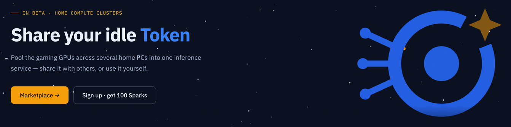

<p align="center">
  <picture>
    <source media="(prefers-color-scheme: dark)" srcset="docs/images/logo-dark.svg">
    
  </picture>
</p>

**闲时分享，忙时扩容。**

让闲置的算力动起来，需求高峰时再取用更多 Token。

[English](README.md)

<p align="center">
  
</p>

---

## 为什么做 IdleToken

智能体的工作负载天然是有峰谷的。大多数时候，可能只有一两个推理任务在运行；但遇到复杂任务时，多个智能体会同时展开工作，短时间内产生大量并行请求，算力需求会迅速上升。

而本地部署的机器，恰好也是有时很忙、有时很闲。人不会时时刻刻都在跑模型，所以一台机器可能在大部分时间里都有富余算力，却偏偏在真正需要大量推理时显得不够用。

IdleToken 想做的，就是把不同人的这些闲时和忙时连接起来：**不用的时候，把算力分享出去赚取火花；需要更多算力的时候，再用火花使用别人此刻闲置的资源。** 让平时闲着的算力，在需要的时候流动到真正有需求的地方。

## 怎么用

IdleToken 是一个桌面客户端，正常使用不需要命令行。

**先选一个模型。** IdleToken 会根据机器当前可用的显存，告诉你哪些模型能跑、可以开多长上下文；如果放不下，也会直接告诉你还差多少显存。

**然后启动它。** 缺少的权重会自动下载，模型就绪后，本地服务默认运行在 `:8000`。

Claude Code 可以直接接入：

```sh
export ANTHROPIC_BASE_URL=http://<你的机器>:8000
export ANTHROPIC_API_KEY=whatever
claude
```

也可以通过 OpenAI 兼容接口调用：

```sh
curl http://<你的机器>:8000/v1/chat/completions \
  -H 'content-type: application/json' \
  -d '{"model":"qwen3-8b","messages":[{"role":"user","content":"你好"}]}'
```

如果一台机器装不下模型，可以再加**同系统的**机器。在一台机器上创建集群并生成验证码，其它机器输入验证码加入。之后的节点发现、容量探测、模型切分和权重下载都会自动完成。

如果有闲置算力，也可以主动打开共享。分享会赚取火花，需要更多算力时，再用火花使用别人分享出来的资源。共享默认关闭，不需要时随时可以关掉。

## 近期更新

<!--
这里保留最近几项值得关注的更新，例如：

- YYYY-MM-DD · 更新内容
- YYYY-MM-DD · 更新内容
- YYYY-MM-DD · 更新内容
-->

## 模型

IdleToken 支持从单卡小模型到需要多机协作的大模型。例如：

| 模型                     |      权重大小 | 说明                   |
| ---------------------- | --------: | -------------------- |
| Qwen3.5-0.8B           |  0.49 GiB |                      |
| Qwen3-8B               |  4.68 GiB |                      |
| Qwen3.5-35B-A3B        | 20.49 GiB | 24 GB，或两台机器          |
| DeepSeek-V4-Flash-0731 | 80.76 GiB | 304B 总参、13B 激活；必须组集群 |

除 DeepSeek-V4-Flash-0731 使用 Q2 外，其余模型均为 Q4_K_M。

完整模型列表和要求将在独立页面维护。

## 硬件要求

计算节点支持 **Windows、Linux 和 macOS**，一台或多台都行。每台机器需要一块受支持的 GPU：

| 平台 | GPU | 另需 |
| --- | --- | --- |
| Windows | NVIDIA，计算能力 ≥ 7.5（RTX 20 系及以后），显存 ≥ 4 GB | 驱动 ≥ 527.41 |
| Linux | NVIDIA，计算能力 ≥ 7.5（RTX 20 系及以后），显存 ≥ 4 GB | 驱动 ≥ 580.65 |
| macOS | Apple Silicon（Metal，统一内存） | — |

**集群必须同构**：同一个集群里的所有计算节点是同一个操作系统。Windows 集群、Linux 集群、
macOS 集群都可以，但 Windows 和 Linux 机器混在一个集群里不行——遇到这种情况 coordinator
会直接拒绝入群，而不是跑一个我们无法验证的东西。单机就是只有一个节点的集群，走的是同一套软件、
同一条路径。

纯 CPU 节点会被直接拒绝，不会自动降级到 CPU 推理。Intel Mac 和 AMD 显卡不能作计算节点。

macOS 这条线比 CUDA 线新、验证也少：DeepSeek-V4-Flash 还没在 Mac 上真跑过（没有内存够大的
机器），小模型因为还没有 Metal kernel 走的是 CPU 参考路径，多台 Mac 组集群也尚未验证。

## 从源码构建

IdleToken 目前处于 **Beta**，安装包尚未发布。首个版本发布之前，需要从源码构建：

```sh
make
cd client && pnpm install && pnpm build
cd src-tauri && cargo build --release
```

目前还需要注意：

* 首个安装包不会有代码签名，Windows 第一次运行时会提示拦截；
* 自动权重下载是新功能，还没有完成端到端走查；
* 暂时没有自动更新；
* 发版前会通过 `scripts/acceptance.sh` 在真实机器上完成验收。

## 许可

**Apache-2.0**

## 致谢

IdleToken 的实现离不开许多优秀的开源项目，特别感谢：

* [ds4](https://github.com/antirez/ds4)
* [llama.cpp / ggml](https://github.com/ggml-org/llama.cpp)
* [Ollama](https://github.com/ollama/ollama)
* [Tauri](https://github.com/tauri-apps/tauri)
* [TweetNaCl](https://tweetnacl.cr.yp.to/)
* [BLAKE2](https://github.com/BLAKE2/BLAKE2)
* [DeepSeek](https://github.com/deepseek-ai)
* [Qwen](https://github.com/QwenLM)

以及所有 IdleToken 所依赖的开源项目和它们的贡献者。
