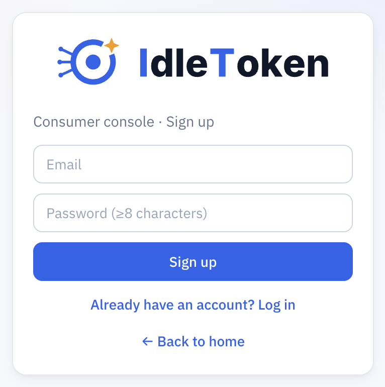
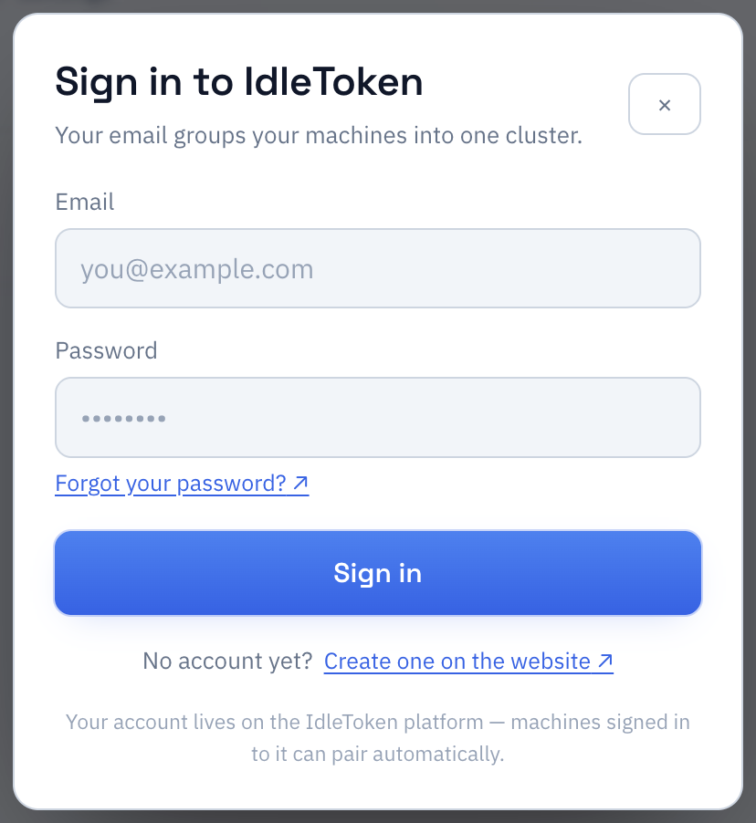
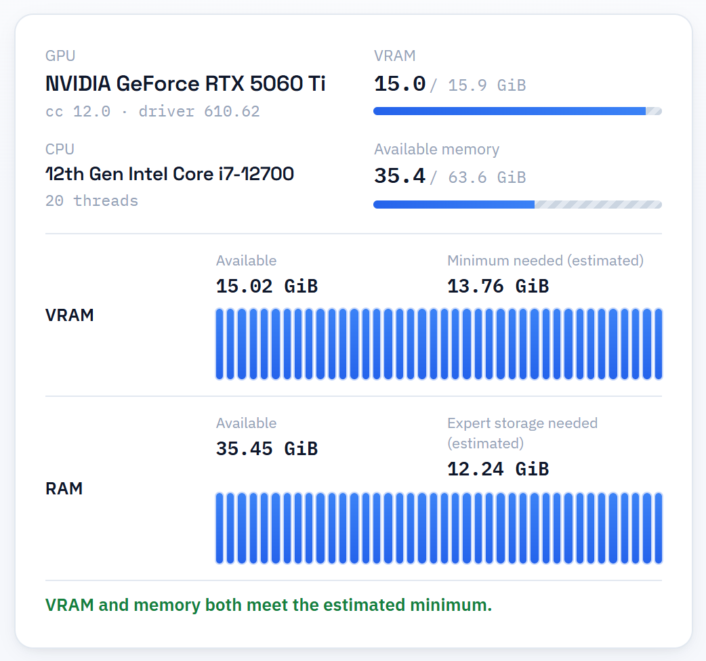
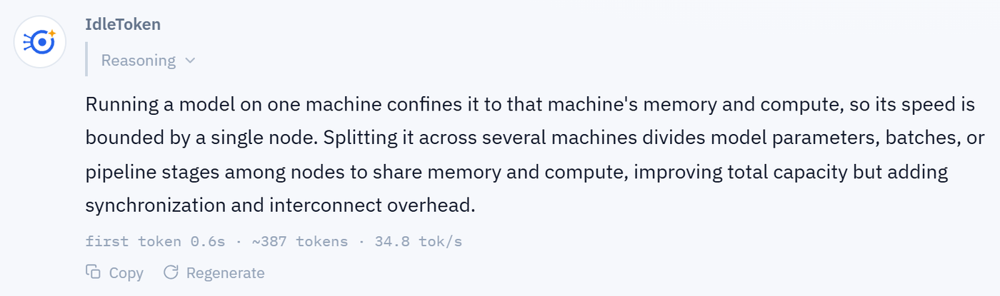
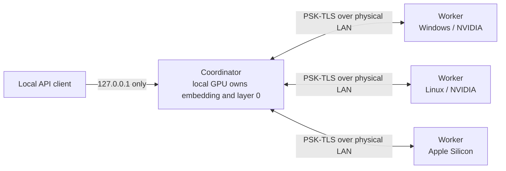
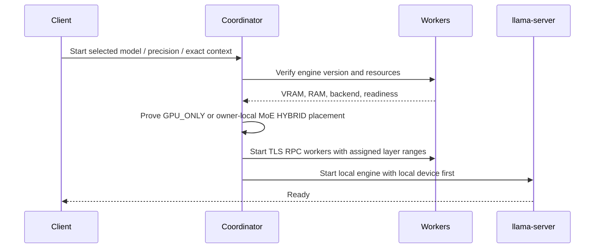
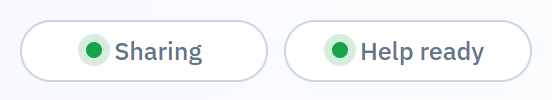
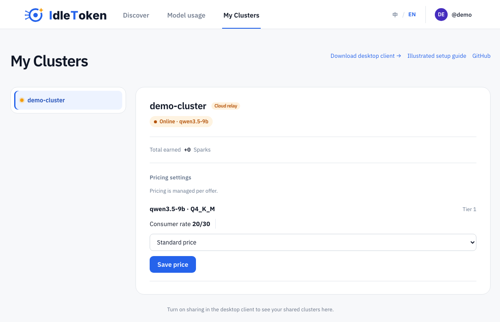
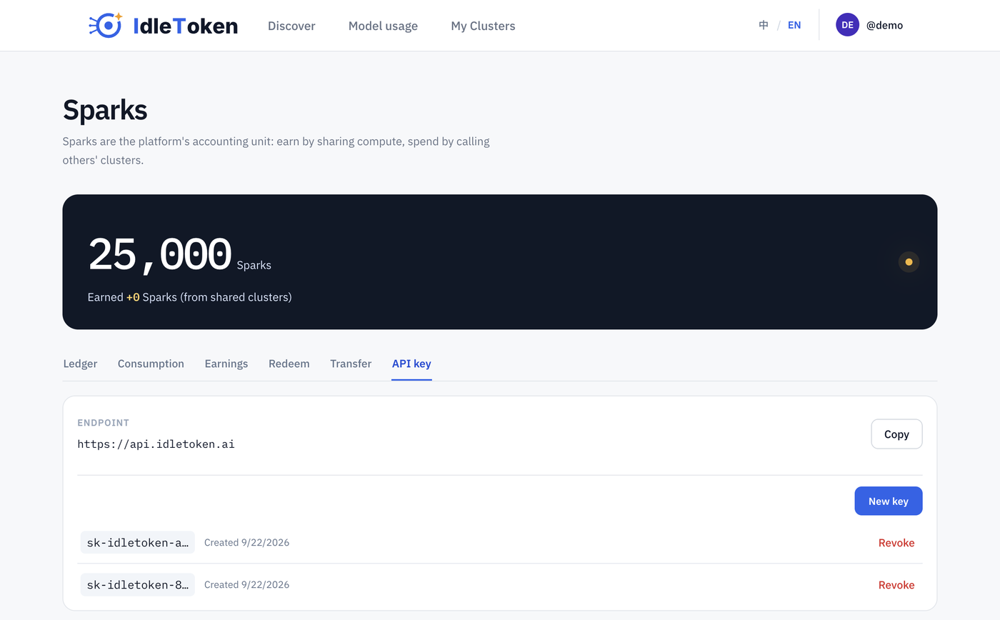

# IdleToken step-by-step guide

IdleToken turns one supported computer—or several Windows, Linux, and macOS
computers on the same LAN—into a text-generation service with OpenAI- and
Anthropic-compatible APIs.

[Chinese version](user-guide.zh-CN.md)

This guide follows the current product contract: curated text-only GGUF models,
an exact 256K default context, an optional exact 1M context, and an explicit
choice between local and clustered deployment.

## Contents

1. [Check the requirements](#1-check-the-requirements)
2. [Install IdleToken](#2-install-idletoken)
3. [Create and verify an account](#3-create-and-verify-an-account)
4. [Run your first model](#4-run-your-first-model)
5. [Build a LAN cluster](#5-build-a-lan-cluster)
6. [Share spare compute](#6-share-spare-compute)
7. [Connect Claude Code and API clients](#7-connect-claude-code-and-api-clients)
8. [Understand the privacy boundary](#8-understand-the-privacy-boundary)
9. [Troubleshoot](#9-troubleshoot)
10. [Understand the Linux channels](#10-understand-the-linux-channels)

## 1. Check the requirements

### Computing machines

| Item | Requirement |
| --- | --- |
| Windows or Linux GPU | NVIDIA, Turing/RTX 20 series or newer, with **at least 8 GiB of physical VRAM** |
| macOS | Apple Silicon with Metal and unified memory |
| Driver | A supported NVIDIA driver; a CUDA Toolkit installation is not required |
| Storage | An SSD with enough space for a complete copy of the selected GGUF on every computing machine |
| Network | The same physical LAN; gigabit Ethernet or better is strongly preferred |
| Version | Every cluster member must run the same IdleToken/llama.cpp engine version |

AMD and Intel GPUs, CPU-only computers, and Intel Macs do not compute model
layers. They can still be controllers. A machine below the hardware floor is
refused clearly; IdleToken never silently falls back to CPU inference.

### Product limits to know first

- The client offers a curated list of **text-generation** models. v2 does not
  accept arbitrary local/Hugging Face model paths and does not support images.
- Context is exactly **256K by default**. Models that support it expose an
  explicit **1M context** option. IdleToken never silently reduces either
  choice to 128K, 64K, or another smaller window.
- After model, precision, and context are selected, **cluster deployment is the
  default main action**. Local deployment remains visible and clickable. The
  interface does not label either choice “recommended.”
- Capacity estimates are warnings, not disabled buttons. The coordinator makes
  the hard admission decision using the exact selected window when you start.

## 2. Install IdleToken

Download the current release from
[GitHub Releases](https://github.com/idletoken/IdleToken/releases/latest).

| System | Release artifact |
| --- | --- |
| Windows x64 | `IdleToken_<version>_x64-setup.exe` |
| Apple Silicon macOS | `IdleToken_<version>_aarch64.dmg` |
| Debian/Ubuntu x86_64 | `IdleToken_<version>_amd64.deb` |
| Debian/Ubuntu arm64 | `IdleToken_<version>_arm64.deb` |
| RPM-based Linux x86_64 | `IdleToken-<version>-1.x86_64.rpm` |
| RPM-based Linux arm64 | `IdleToken-<version>-1.aarch64.rpm` |

### Windows

1. Download and run the NSIS `.exe`.
2. IdleToken is not Authenticode-signed yet, so SmartScreen may show “Windows
   protected your PC.” Verify the SHA-256 value published with the release:

   ```powershell
   Get-FileHash .\IdleToken_<version>_x64-setup.exe -Algorithm SHA256
   ```

3. If the digest matches, choose **More info → Run anyway**.
4. Allow the Windows Firewall prompt. If rules cannot be installed without
   elevation, the client log prints the one-time administrator command.

### macOS

1. Open the `.dmg` and drag IdleToken into Applications.
2. On the first launch, right-click IdleToken and choose **Open**. If macOS
   still blocks it, use **System Settings → Privacy & Security → Open Anyway**.
3. Only Apple Silicon Macs are compute nodes. Intel Macs remain controllers.

### Linux

```sh
# Debian / Ubuntu
sudo apt install ./IdleToken_<version>_amd64.deb

# Fedora / RHEL / openSUSE
sudo rpm -Uvh IdleToken-<version>-1.x86_64.rpm
```

The package includes the required user-space CUDA runtime libraries. Install a
compatible NVIDIA driver, but do not install a CUDA Toolkit just for IdleToken.
Current Linux packages declare **glibc 2.39 or newer**, so the package manager
rejects an older distribution before installation. If installation succeeds
but the loader still reports a missing `GLIBC_*` symbol, that is a packaging
compatibility bug, not a missing CUDA component; report the distribution
version and complete error on GitHub.

There is no in-app updater. Upgrade by downloading and running the current
native installer again.

## 3. Create and verify an account

An account is optional for a code-paired private LAN cluster. It is required to
share compute, use the public marketplace, or pair through account identity.

### Register

Open [idletoken.ai](https://idletoken.ai), select **Sign up**, and enter an
email address and a password of at least eight characters.



The first visit uses Chinese only when the browser's preferred locale is
Chinese; every other locale falls back to English. The language switch is saved
to your account after sign-in. Verification and password-reset mail then use
that account language.

### Verify the email

Open the message from `no-reply@idletoken.ai` and follow the link within 24
hours. If it is missing:

1. Check Spam and Promotions.
2. Mark a legitimate message as “Not spam.”
3. Use **Resend verification email** after the one-minute cooldown.
4. If Gmail repeatedly classifies it as spam, include the message's
   `Authentication-Results` header in a report. It identifies whether SPF,
   DKIM, or DMARC failed; the inbox placement alone does not.

### Sign in to the client

Use the same email in the desktop client.



Signing in establishes identity. Private cluster inference still runs on your
machines over your LAN.

## 4. Run your first model

### Choose the model, precision, and context

1. Open **Cluster**.
2. Choose a model from the curated list.
3. Choose a precision. Lower precision generally needs less memory; higher
   precision generally preserves more model quality.
4. Keep the exact **256K** context, or enable exact **1M context** if that model
   supports it and you genuinely need it.

The resource card updates as you change the selection:



- **Available** is measured from the current roster.
- **Needed (estimated)** includes weights, the exact context's KV cache,
  measured graph workspace, and node overhead.
- For an MoE model on a discrete GPU, the card may also show system RAM for the
  owner-local expert fallback. Dense models never use that fallback.

### Download the weights

Select **Download weights** and wait for verification to finish. Every compute
node needs a complete copy of the selected GGUF. Keep the files on SSD storage.

### Choose where it runs

The cluster action is the main button. Choose it when you want a multi-machine
deployment—even if one machine could fit the model. Choose the local action
when you want single-machine inference. IdleToken honors that choice and does
not secretly switch modes.

If the estimate warns about a shortfall, the buttons remain available. Start
the mode you chose; the coordinator either proves the exact placement or
returns `[RESOURCE_INSUFFICIENT]` with the real requirement and availability.

### Chat

Once the status is **Ready**, open **Chat** and send a text message.



Curated models reason by default. Their reasoning appears in a collapsed
**Reasoning** section. There is no client-side thinking switch; API callers can
disable thinking per request when needed.

## 5. Build a LAN cluster



### Before pairing

On every compute node:

1. Install the same IdleToken release.
2. Select the same model, precision, and context.
3. Finish downloading and verifying the complete model.
4. Connect to the same physical LAN. Do not use a Tailscale, VPN, or other
   overlay address for tensor traffic.

### Pair with an account

Sign in with the same account on each machine. Create the cluster on the
machine that should coordinate it, then approve the other visible machines.

### Pair with a one-time code

1. On the first machine choose **Create cluster** and copy the pairing code.
2. On every other machine choose **Join cluster** and enter that code.
3. Confirm that every expected hostname is present in the roster.
4. Start the cluster from the creator.

Discovery uses the LAN. The pairing secret is never the discovery broadcast,
and the RPC transport refuses plaintext unless a test-only escape hatch is
explicitly enabled.

### What startup does



Layer 0 and the embedding lookup stay on the coordinator's local device. If the
coordinator has no supported local compute, startup is refused. If the internal
engine gives up after repeated crashes, the client leaves **Loading**, shows the
failure, stops that attempt, and allows a real retry after you address the cause.

## 6. Share spare compute

Sharing is opt-in and separate from forming a private cluster.

1. Sign in and get your private model to **Ready**.
2. Open **Settings** and enable sharing.

   

3. Wait for the client to show the service as listed.
4. Open **My Clusters** on the portal.

   

The My Clusters header includes direct links to the desktop download, this
guide, and GitHub. A newly registered service starts with standard pricing and
fresh service statistics. Seller reputation belongs to the account and survives
service restarts. Turning sharing off stops new platform work; work already in
flight is allowed to finish.

## 7. Connect Claude Code and API clients

### Local API

The local endpoint is `http://127.0.0.1:8000` by default. It is deliberately
loopback-only. A different computer cannot reach it by LAN IP.

No local token is required by default. If you explicitly configure an API
token, clients must send it. Requests with a browser `Origin` header are denied
to protect the loopback API from cross-site requests.

### Claude Code

```sh
export ANTHROPIC_BASE_URL=http://127.0.0.1:8000
export ANTHROPIC_API_KEY=idletoken
export NO_PROXY=127.0.0.1,localhost
claude
```

Claude Code requires a non-empty key variable; `idletoken` is a placeholder
unless you configured a local token.

### OpenAI-compatible request

```sh
curl http://127.0.0.1:8000/v1/chat/completions \
  -H 'content-type: application/json' \
  -d '{"model":"<model-id>","messages":[{"role":"user","content":"Hello"}],"max_tokens":128}'
```

### Anthropic-compatible request

```sh
curl http://127.0.0.1:8000/v1/messages \
  -H 'content-type: application/json' \
  -d '{"model":"<model-id>","max_tokens":128,"messages":[{"role":"user","content":"Hello"}]}'
```

Both protocols support streaming. `GET /v1/models` reports the model currently
served by this coordinator.

### Platform API

For remote consumption or shared compute, open **Sparks → API keys** on the
portal and create a key.



```sh
curl https://api.idletoken.ai/v1/chat/completions \
  -H 'authorization: Bearer <your-key>' \
  -H 'content-type: application/json' \
  -d '{"model":"<model-name>","messages":[{"role":"user","content":"Hello"}]}'
```

The secret is shown once. Copy it immediately.

## 8. Understand the privacy boundary

- In a private LAN cluster, embedding lookup and layer 0 remain on the
  coordinator. Cross-machine RPC uses PSK-TLS over the physical LAN.
- The public API is loopback-only. Remote consumption uses the platform relay
  and encrypted transport envelopes.
- The commercial platform is **not an end-to-end-blind party**. It may process
  plaintext for routing, moderation, abuse handling, and accounting. Do not
  describe transport-envelope encryption as “the platform cannot read prompts.”
- A worker you do not trust is still a trust decision. The design raises the
  cost of casual leakage; it does not claim protection from a determined
  attacker controlling a participating machine.

## 9. Troubleshoot

### A machine cannot find the cluster

1. Confirm both machines are on the same physical LAN and client isolation is
   disabled on the router.
2. Allow IdleToken through the host firewall.
3. Do not advertise a VPN, Tailscale, or other overlay address.
4. Confirm every machine runs the same release.

### Loading never finishes

- A healthy large model can take minutes. The API may return
  `503 {"status":"loading model"}` before it becomes ready.
- A permanent internal-engine failure must change the card from **Loading** to
  a visible failure. Open the engine log, address the reported cause, and start
  again. If the timer still grows after a permanent-failure line, report both
  the log and client version.

### A request hangs at the end of a stream

Set `NO_PROXY=127.0.0.1,localhost`. Local HTTP proxies such as Clash can
intercept loopback SSE and swallow the end-of-stream signal.

### Linux window is blank

Launch once with:

```sh
WEBKIT_DISABLE_DMABUF_RENDERER=1 idletoken
```

If it fixes the window, add that environment variable to the desktop launcher.

### A second local request appears to wait

That is expected. Local inference has one execution slot. Later requests wait
in the local queue while IdleToken also tries configured overflow capacity.
Temporary platform unavailability, rate limits, or provider failure do not turn
the queued local request into an error; it runs locally when the slot is free.
Only cancellation removes it from the queue.

## 10. Understand the Linux channels

IdleToken currently publishes native `.deb` and `.rpm` installers.

- **Arch/AUR** is a distribution-specific build-recipe channel. An AUR package
  usually downloads source or release assets and builds/installs them through
  `pacman`. IdleToken does not currently maintain an official AUR recipe.
- **Flatpak** is a cross-distribution sandboxed application format delivered
  through a repository such as Flathub. Packaging a GPU worker, bundled CUDA
  user-space runtime, LAN discovery, firewall integration, and sidecars inside
  that sandbox requires a separately tested product path. IdleToken does not
  currently publish a Flatpak.

These are additional distribution channels, not files that can be produced by
renaming a `.deb` or `.rpm`. Until they have their own final-package tests, use
the supported native package for a compatible distribution or build from the
public repository.
