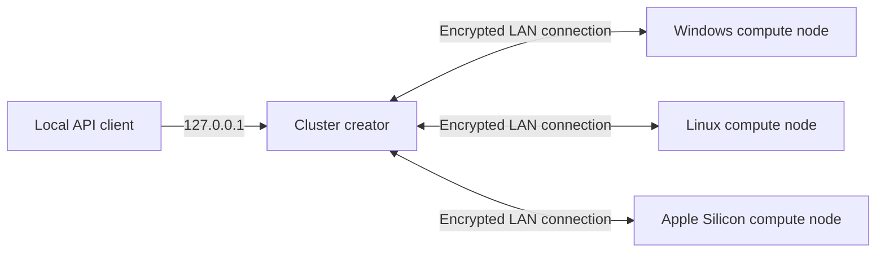

# IdleToken user guide

IdleToken can run a large language model on one supported computer or combine
several Windows, Linux, and macOS computers on the same LAN into an inference
cluster. Once running, it provides OpenAI- and Anthropic-compatible APIs.

[Chinese version](user-guide.zh-CN.md)

This guide covers installation, accounts, models, LAN clustering, compute
sharing, API access, and common troubleshooting.

## Contents

1. [Check the device requirements](#1-check-the-device-requirements)
2. [Install IdleToken](#2-install-idletoken)
3. [Create an account and sign in](#3-create-an-account-and-sign-in)
4. [Run your first model](#4-run-your-first-model)
5. [Build a LAN cluster](#5-build-a-lan-cluster)
6. [Share spare compute](#6-share-spare-compute)
7. [Connect Claude Code and API clients](#7-connect-claude-code-and-api-clients)
8. [Troubleshoot](#8-troubleshoot)

## 1. Check the device requirements

### Compute nodes

| Item | Requirement |
| --- | --- |
| Windows or Linux GPU | NVIDIA Turing / RTX 20 series or newer, with at least 8 GiB of physical VRAM |
| macOS | Apple Silicon with Metal and unified memory |
| Driver | A supported NVIDIA driver; no separate CUDA Toolkit installation is required |
| Storage | An SSD with room for a complete copy of the selected GGUF on every compute node |
| Network | The same LAN for multi-machine use; gigabit Ethernet is recommended |
| Version | The same IdleToken version on every machine in a cluster |

AMD and Intel GPUs, CPU-only computers, and Intel Macs cannot join a cluster as
compute nodes. The client may still open, but cluster creation and joining
require supported compute hardware. IdleToken never silently falls back to CPU
inference.

### Models and context windows

- The client offers an adapted model catalog. It does not accept arbitrary
  local model paths or Hugging Face URLs.
- Models marked with image support can accept pictures; other models accept
  text only.
- The default context is exactly 128K. The selector also offers exact 256K and
  1M windows when the model supports them. Startup never silently changes the
  selected window to another tier.
- Both **On this machine only** and **Across several machines** remain visible.
  Multi-machine execution is the default primary action, without a
  "recommended" label. A capacity warning does not disable either choice, and
  an explicit multi-machine choice never silently falls back to local mode.
- The capacity card is a preflight estimate. Startup performs the final check.

## 2. Install IdleToken

Download the package matching your operating system and CPU architecture from
[GitHub Releases](https://github.com/idletoken/IdleToken/releases/latest).

| System | Release artifact |
| --- | --- |
| Windows x64 | `IdleToken_<version>_x64-setup.exe` |
| Apple Silicon macOS | `IdleToken_<version>_aarch64.dmg` |
| Debian / Ubuntu x86_64 | `IdleToken_<version>_amd64.deb` |
| Debian / Ubuntu arm64 | `IdleToken_<version>_arm64.deb` |
| RPM-based Linux x86_64 | `IdleToken-<version>-1.x86_64.rpm` |
| RPM-based Linux arm64 | `IdleToken-<version>-1.aarch64.rpm` |

Only the packages listed above are official release targets. Users of other
Linux distributions may adapt the open-source build, but those packages are
not produced or supported by the project.

### Windows

1. Download and run the NSIS `.exe`.
2. The installer is not Authenticode-signed, so SmartScreen may show "Windows
   protected your PC." First compare its SHA-256 digest with the value on the
   Release page:

   ```powershell
   Get-FileHash .\IdleToken_<version>_x64-setup.exe -Algorithm SHA256
   ```

3. If the digest matches, choose **More info -> Run anyway**.
4. Allow the Windows Firewall prompt. If automatic rule creation fails, the
   client log shows the command that must be run as administrator.

### macOS

1. Open the `.dmg` and drag IdleToken into Applications.
2. On first launch, right-click IdleToken and choose **Open**. If macOS still
   blocks it, use **System Settings -> Privacy & Security -> Open Anyway**.
3. Apple Silicon Macs can compute. Intel Macs are not supported as compute nodes.

### Linux

Debian / Ubuntu:

```sh
# x86_64
sudo apt install ./IdleToken_<version>_amd64.deb

# arm64
sudo apt install ./IdleToken_<version>_arm64.deb
```

Fedora and compatible `dnf`-based distributions (see the glibc floor below):

```sh
# x86_64
sudo dnf install ./IdleToken-<version>-1.x86_64.rpm

# arm64
sudo dnf install ./IdleToken-<version>-1.aarch64.rpm
```

Linux packages include the required user-space CUDA runtime libraries. You only
need a compatible NVIDIA driver. The published v0.1.90 Linux packages require
glibc 2.39. The next packages built from the current source target glibc 2.35
and will declare that floor in package metadata; the lower floor does not take
effect until those packages are actually released. The official Linux release
lane supports `.deb` and `.rpm`; dependency names vary on other RPM
distributions, so do not assume that the Fedora package installs unchanged on
RHEL or openSUSE.

IdleToken has no in-app updater. To upgrade, download and install the newer
native package over the existing installation.

## 3. Create an account and sign in

You can build a private LAN cluster with a one-time pairing code and no account.
An account is required to:

- discover your own machines through account identity;
- share compute;
- use the platform API or shared marketplace.

### Register and verify the email

1. Open [idletoken.ai](https://idletoken.ai) and select **Sign up**.
2. Enter an email address and a password of at least eight characters.

   

3. Open the message from `no-reply@idletoken.ai` and follow its link within 24
   hours.
4. Return to the portal and sign in.

On the first visit, the portal uses Chinese when it is the browser's preferred
language and English otherwise. After sign-in, a language change is saved to
the account. Verification and password-reset messages use the same language.

### Sign in to the desktop client

Open the account control in the client and sign in with the same email address
and password.


Sign-in provides account identity, automatic pairing, and platform features.
Private-cluster inference still runs on your machines and LAN.

## 4. Run your first model

### Choose the model, precision, and context

1. Open **Cluster**.
2. Choose a model and precision under **Selected**.
3. Keep the default 128K context, or select 256K / 1M when the model supports
   them. Larger windows generally require more VRAM or unified memory.
4. Review the capacity card.


- **Available** is measured from the current machine or cluster roster.
- **Needed (estimated)** includes model weights, the selected context, and
  runtime overhead.
- A discrete-GPU MoE model may also show a system-memory estimate for expert
  storage.

### Download the model files

If the selected model is not ready, choose **Download weights** and wait for the
download and hash verification to finish. Models with image support also
download a vision file. Every compute node in a multi-machine deployment needs
a complete copy of the model files.

### Choose local or multi-machine execution

- **Create a cluster** is the default primary action and combines several
  machines. The next dialog also lets this machine join an existing cluster.
- Choose **Run it here** when you explicitly want the no-LAN-RPC local path.

The capacity estimate only warns; it does not disable either action. Startup
performs the hard resource check for the exact selected context. If it reports
`[RESOURCE_INSUFFICIENT]`, lower the precision, switch from 1M to 256K when
applicable, free memory, or add compute nodes and try again.

### Chat

When the status becomes **Ready**, open **Chat** and send a message.


Model reasoning appears in a collapsed **Reasoning** section. When the current
model supports images, an image button appears beside the composer. It accepts
PNG, JPEG, WebP, and GIF files. If the button is absent, the current model is
text-only.

## 5. Build a LAN cluster



### Before pairing

On every compute node:

1. Install the same IdleToken version.
2. Connect to the same physical LAN. Do not route compute traffic through a
   Tailscale, VPN, or other overlay address.
3. Prepare the same model, precision, and context.
4. Finish downloading and verifying the model files.

### Use the same account

Sign in with the same account on each machine. On the first machine, choose
**Create with this account**. On every other machine, choose **Auto-join this
account's cluster**. The client searches the current LAN for a cluster created
under that account, so no pairing code is required.

### Use a one-time pairing code

1. On the first machine, choose **Create a cluster** and copy the pairing code.
2. On each other machine, choose **Join cluster** and enter the code.
3. Confirm that every expected machine appears in the member list.
4. Start the cluster from the creator.

Startup checks member versions, model files, and resources. If a member is not
ready, the client identifies that machine and the reason. After every check
passes, the status changes to **Cluster ready**; the coordinator's page shows
the local API address. That API remains loopback-only on the coordinator.

LAN discovery only finds machines; it does not broadcast the pairing
credential. RPC connections between compute nodes use PSK-TLS encryption.

## 6. Share spare compute

Sharing is a separate opt-in. Creating a private cluster does not enable it.

1. Sign in to the client and bring the model to **Ready**.
2. Select **Share compute** in the top-right corner of the client.
3. Wait for the button to change to **Sharing**.

   

4. Sign in to the portal and open **My Clusters**. Confirm that the service is
   online, then manage pricing if needed.

   

Turning sharing off prevents new platform work from being assigned to the
service. Work already in progress is allowed to finish. If sharing reports a
failure, open its error details or recent agent log and follow the message for
the account, client version, or network issue.

## 7. Connect Claude Code and API clients

### Local API

The default address is `http://127.0.0.1:8000`. It is reachable only from the
computer running IdleToken. If you explicitly configured a local API token,
for example through `IDLETOKEN_API_TOKEN`, send that token with each request.

### Claude Code

```sh
export ANTHROPIC_BASE_URL=http://127.0.0.1:8000
export ANTHROPIC_API_KEY=idletoken
claude
```

Claude Code requires a non-empty `ANTHROPIC_API_KEY`. If no local API token is
configured, `idletoken` is only a placeholder. If you configured one, replace
the placeholder with the real value.

### OpenAI-compatible request

```sh
curl http://127.0.0.1:8000/v1/chat/completions \
  -H 'content-type: application/json' \
  -d '{"model":"<model-id>","messages":[{"role":"user","content":"Hello"}],"max_tokens":128}'
```

### Anthropic-compatible request

```sh
curl http://127.0.0.1:8000/v1/messages \
  -H 'content-type: application/json' \
  -d '{"model":"<model-id>","max_tokens":128,"messages":[{"role":"user","content":"Hello"}]}'
```

Both protocols support streaming responses. `GET /v1/models` reports the model
served by this coordinator.

### Platform API

1. Sign in to the portal.
2. Open the account menu in the top-right corner, then choose
   **Sparks -> API keys**.
3. Select **New key** and immediately copy the secret, which is shown once.


```sh
curl https://api.idletoken.ai/v1/chat/completions \
  -H 'authorization: Bearer <your-key>' \
  -H 'content-type: application/json' \
  -d '{"model":"<model-name-or-model:quant>","messages":[{"role":"user","content":"Hello"}]}'
```

Platform requests spend Sparks from the account. Use the portal's Discover page
or `GET /catalog` to see models and precisions with an online service.

### Models and precisions

When a request specifies only a model name, the platform uses the account's
scheduling preference to choose among all currently available precisions and
services for that model. When a request uses `model:quant`, the platform first
tries the requested precision. If it is unavailable and **Allow higher-precision
substitution** is enabled, the platform applies the same scheduling preference
only to higher precisions of the same model. It never substitutes a lower
precision. If no higher precision is available, or if substitution is disabled,
the request returns a no-service error. Charges always use the precision that
actually serves the request.

## 8. Troubleshoot

### Verification or reset mail does not arrive

1. Check Spam and Promotions.
2. Confirm that the account email address is spelled correctly.
3. Wait for the cooldown shown by the portal, then resend once.
4. If you find a legitimate message in Spam, mark it as "Not spam."

### A machine cannot find the cluster

1. Confirm the machines are on the same LAN and client isolation is disabled on
   the router.
2. Allow the operating-system firewall prompt.
3. Disable a VPN that takes over LAN routes, and do not use an overlay address
   such as Tailscale for compute traffic.
4. Confirm that every machine runs the same IdleToken version.

### The model cannot start

- Confirm that weights and the vision file, when required, finished downloading
  and passed verification.
- Use the capacity card and error details to free VRAM or RAM, select a lower
  precision, or switch from 1M to 256K when applicable.
- For a cluster, check whether the error identifies an offline or mismatched
  member.

### Loading takes too long

A large model can take several minutes to load. Open the engine log to see its
current stage. If the card shows an error, address the logged cause before
trying again. Include the client version, error details, and relevant log when
reporting a problem.

### The Linux window is blank

Launch the client once from a terminal:

```sh
WEBKIT_DISABLE_DMABUF_RENDERER=1 idletoken-client
```

If the interface appears, add that environment variable to the desktop
launcher.

### A second local request keeps waiting

Local inference processes one request at a time, so later requests wait in a
queue. If **Request help** is enabled, IdleToken looks for shared compute while
the request remains queued locally. With no shared provider, it runs when the
local slot becomes free. You can cancel a waiting request from Chat.
