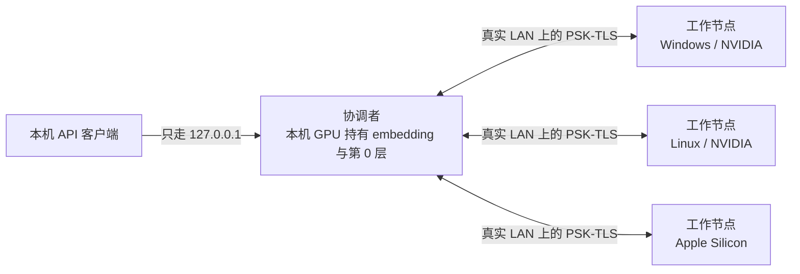
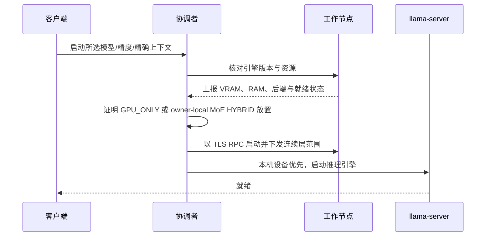

# IdleToken 手把手使用教程

IdleToken 可以把一台受支持的电脑，或者同一局域网里的多台 Windows、Linux、macOS
电脑，变成一套文本生成服务，并提供 OpenAI 与 Anthropic 兼容 API。

[English version](user-guide.md)

这份教程按当前产品契约写：只提供精选的纯文本 GGUF 模型；上下文默认是精确 256K，
模型支持时可以显式选精确 1M；单机还是联机由用户自己决定。

## 目录

1. [先确认要求](#1-先确认要求)
2. [安装 IdleToken](#2-安装-idletoken)
3. [注册并验证账号](#3-注册并验证账号)
4. [跑通第一个模型](#4-跑通第一个模型)
5. [组建局域网集群](#5-组建局域网集群)
6. [分享闲置算力](#6-分享闲置算力)
7. [接入 Claude Code 与 API 客户端](#7-接入-claude-code-与-api-客户端)
8. [理解隐私边界](#8-理解隐私边界)
9. [排障](#9-排障)
10. [Arch 与 Flatpak 是什么](#10-arch-与-flatpak-是什么)

## 1. 先确认要求

### 参与计算的机器

| 项目 | 要求 |
| --- | --- |
| Windows / Linux 显卡 | NVIDIA Turing / RTX 20 系或更新，**物理显存至少 8 GiB** |
| macOS | Apple Silicon，使用 Metal 与统一内存 |
| 驱动 | 受支持的 NVIDIA 驱动；不要求安装 CUDA Toolkit |
| 磁盘 | 固态盘；每台计算节点都要放得下一整份选中的 GGUF |
| 网络 | 同一个真实局域网，强烈建议千兆有线或更好 |
| 版本 | 集群里每台机器必须使用同一个 IdleToken / llama.cpp 引擎版本 |

AMD/Intel 显卡、纯 CPU 电脑、Intel Mac 不参与模型层计算，但仍可以当控制端。
硬件达不到门槛时会明确拒绝，绝不会静默退回 CPU 推理。

### 开始前要知道的产品边界

- 客户端只提供精选的**文本生成**模型。v2 不开放本地路径/Hugging Face 手输入口，
  也不支持图片输入。
- 上下文默认是精确 **256K**。模型能力允许时可以显式勾选精确 **1M**。
  IdleToken 不会偷偷把选择降到 128K、64K 或更短。
- 选完模型、精度和上下文后，**联机始终是默认主按钮**；单机入口始终显示且可点。
  界面不把任何一个写成「推荐」。
- 资源预估只做风险提示，不会锁死按钮。真正启动时，协调者才按你选中的精确窗口
  做运行时硬准入。

## 2. 安装 IdleToken

从 [GitHub Releases](https://github.com/idletoken/IdleToken/releases/latest)
下载当前版本。

| 系统 | 安装文件 |
| --- | --- |
| Windows x64 | `IdleToken_<版本>_x64-setup.exe` |
| Apple Silicon macOS | `IdleToken_<版本>_aarch64.dmg` |
| Debian/Ubuntu x86_64 | `IdleToken_<版本>_amd64.deb` |
| Debian/Ubuntu arm64 | `IdleToken_<版本>_arm64.deb` |
| RPM 系 Linux x86_64 | `IdleToken-<版本>-1.x86_64.rpm` |
| RPM 系 Linux arm64 | `IdleToken-<版本>-1.aarch64.rpm` |

### Windows

1. 下载并运行 NSIS `.exe`。
2. IdleToken 目前还没有 Authenticode 签名，SmartScreen 可能显示
   「Windows 已保护你的电脑」。先核对 Releases 同时公布的 SHA-256：

   ```powershell
   Get-FileHash .\IdleToken_<版本>_x64-setup.exe -Algorithm SHA256
   ```

3. 摘要一致后，选择 **更多信息 → 仍要运行**。
4. 允许 Windows 防火墙提示。如果程序没有提权、无法自动建规则，日志会打印一条
   只需管理员执行一次的命令。

### macOS

1. 打开 `.dmg`，把 IdleToken 拖进「应用程序」。
2. 第一次启动时，右键 IdleToken → **打开**。仍被拦截时，到
   **系统设置 → 隐私与安全性 → 仍要打开**。
3. 只有 Apple Silicon Mac 是计算节点；Intel Mac 仍可当控制端。

### Linux

```sh
# Debian / Ubuntu
sudo apt install ./IdleToken_<版本>_amd64.deb

# Fedora / RHEL / openSUSE
sudo rpm -Uvh IdleToken-<版本>-1.x86_64.rpm
```

安装包已经包含所需的 CUDA 用户态运行库。只需安装兼容的 NVIDIA 驱动，不要为了
IdleToken 额外安装 CUDA Toolkit。当前 Linux 包明确声明需要 **glibc 2.39 或更新**，
旧发行版会在安装前由包管理器拒绝。如果安装成功后加载器仍报缺少 `GLIBC_*` 符号，
那是安装包兼容性 bug，不是少装 CUDA；请在 GitHub 报告发行版版本与完整报错。

IdleToken 没有应用内更新器。升级方式就是下载当前原生安装包，再覆盖安装一次。

## 3. 注册并验证账号

如果只用一次性组网码搭私有 LAN 集群，可以不注册。分享算力、使用公开市场，或者用
账号身份组网时才需要账号。

### 注册

打开 [idletoken.ai](https://idletoken.ai)，点 **注册**，填写邮箱与至少 8 位密码。


浏览器首选语言是中文时，网站默认显示中文；其他所有语言默认回退英文。登录后切换语言，
选择会写入账号。验证邮件和密码重置邮件随后也使用这个账号语言。

### 验证邮箱

打开 `no-reply@idletoken.ai` 发来的邮件，在 24 小时内点链接。没有收到时：

1. 检查垃圾邮件和推广邮件。
2. 如果邮件是真的，把它标为「不是垃圾邮件」。
3. 等一分钟冷却后点 **重发验证邮件**。
4. Gmail 反复判垃圾邮件时，反馈请附上邮件原文里的 `Authentication-Results` 头。
   它能区分 SPF、DKIM、DMARC 到底是哪一项失败；只看它进了哪个文件夹无法判断。

### 在客户端登录

桌面客户端用同一个邮箱登录。


登录只建立身份。私有集群的推理仍然发生在你的机器与局域网里。

## 4. 跑通第一个模型

### 选模型、精度和上下文

1. 打开 **集群**。
2. 从精选清单里选择模型。
3. 选择精度。通常精度越低越省内存，精度越高越能保留模型质量。
4. 保持精确 **256K**，或者在模型支持且确实需要时勾选精确 **1M 上下文**。

选择变化时，资源卡会实时更新：


- **可用** 来自当前真实名册的测量。
- **需要（预估）** 包括权重、精确窗口的 KV、实测 graph workspace 与节点开销。
- 离散显卡上的 MoE 模型可能额外显示系统内存，供 owner-local 专家后备使用。
  稠密模型不走这条后备。

### 下载权重

点 **下载权重**，等下载与校验完成。每台计算节点都需要选中 GGUF 的完整副本，
并应放在固态盘上。

### 选择跑在哪里

联机是主按钮。即使一台机器也放得下，只要你想用多机，就点联机。想走完全不经 RPC
的单机路径，就点单机。IdleToken 会尊重选择，不会偷偷切换部署形态。

预估短缺时按钮仍可点。协调者会证明精确放置是否成立；不成立时返回
`[RESOURCE_INSUFFICIENT]`，并列出真实需要量与可用量。

### 聊天

状态变为 **就绪** 后，打开 **聊天**，发送一条文本消息。


精选模型默认思考，思考内容收在默认折叠的 **思考** 栏里。客户端没有思考开关；
API 调用方需要时可以逐请求关闭。

## 5. 组建局域网集群



### 配对前

每台计算节点都要：

1. 安装同一个 IdleToken 版本。
2. 选择同一个模型、精度、上下文。
3. 把完整模型下载并校验好。
4. 接入同一个真实局域网。张量流量不要走 Tailscale、VPN 或其他 overlay 地址。

### 用账号组网

每台机器登录同一个账号。在准备当协调者的机器上创建集群，再批准列表里的其他机器。

### 用一次性组网码

1. 第一台机器点 **创建集群**，复制组网码。
2. 其他机器点 **加入集群**，输入这串码。
3. 检查名册里是否出现所有预期主机名。
4. 从创建方启动集群。

发现走局域网广播，但广播内容不是配对密钥。RPC 传输强制加密，除非明确打开只用于测试
的逃生口，否则明文启动会被拒绝。

### 启动时发生什么



embedding 查表和第 0 层必须留在协调者本机。协调者没有受支持的本地算力时，启动会拒绝。
内部引擎连续崩溃并彻底放弃后，客户端会离开「加载中」、显示真实原因、停止这次实例；
修掉原因后再次点开始，会启动一个真正的新实例。

## 6. 分享闲置算力

分享是显式选择，和搭私有集群是两件事。

1. 登录，并让私有模型达到 **就绪**。
2. 打开 **设置**，开启分享。

   

3. 等客户端显示服务已经上架。
4. 打开门户里的 **我的集群**。

   

「我的集群」页头现在直接提供桌面客户端下载、这份教程和 GitHub 链接。每个新服务从
标准定价与全新服务统计开始；卖家声誉属于账号，服务重启后仍保留。关闭分享后不再接新任务，
已经执行中的任务允许完成。

## 7. 接入 Claude Code 与 API 客户端

### 本机 API

默认地址是 `http://127.0.0.1:8000`，并且强制只服务本机。另一台电脑不能通过局域网 IP
直接访问它。

默认不要求本机令牌。用户显式配置令牌后，客户端才必须发送。带浏览器 `Origin` 头的请求
会被拒绝，用来防止网页跨站调用回环 API。

### Claude Code

```sh
export ANTHROPIC_BASE_URL=http://127.0.0.1:8000
export ANTHROPIC_API_KEY=idletoken
export NO_PROXY=127.0.0.1,localhost
claude
```

Claude Code 要求 key 环境变量非空；如果你没有显式设置本机令牌，`idletoken` 只是占位值。

### OpenAI 兼容请求

```sh
curl http://127.0.0.1:8000/v1/chat/completions \
  -H 'content-type: application/json' \
  -d '{"model":"<模型 id>","messages":[{"role":"user","content":"你好"}],"max_tokens":128}'
```

### Anthropic 兼容请求

```sh
curl http://127.0.0.1:8000/v1/messages \
  -H 'content-type: application/json' \
  -d '{"model":"<模型 id>","max_tokens":128,"messages":[{"role":"user","content":"你好"}]}'
```

两套协议都支持流式。`GET /v1/models` 返回当前协调者真实加载的模型。

### 平台 API

要远程消费或使用共享算力，到门户的 **火花 → API 密钥** 创建一把密钥。


```sh
curl https://api.idletoken.ai/v1/chat/completions \
  -H 'authorization: Bearer <你的密钥>' \
  -H 'content-type: application/json' \
  -d '{"model":"<模型名>","messages":[{"role":"user","content":"你好"}]}'
```

密钥只显示一次，请当场复制。

## 8. 理解隐私边界

- 私有 LAN 集群里，embedding 查表和第 0 层留在协调者；跨机器 RPC 在真实 LAN 上走
  PSK-TLS。
- 公共 API 只绑定回环。远程消费通过平台中继与加密传输信封。
- 商业平台**不是端到端不可见的一方**。它可能为了路由、审核、滥用处理与计量处理明文。
  不能把「传输信封加密」描述成「平台看不到提示词」。
- 把一台不信任的机器加入集群本身就是信任决定。设计目标是提高一般性泄露的成本，
  不是宣称能挡住控制了参与机器的坚定攻击者。

## 9. 排障

### 机器找不到集群

1. 确认都在同一个真实 LAN，路由器没有开启 AP/客户端隔离。
2. 放行主机防火墙。
3. 不要通告 VPN、Tailscale 或其他 overlay 地址。
4. 确认每台机器运行同一个版本。

### 加载一直不结束

- 健康的大模型确实可能加载几分钟。就绪前 API 可能返回
  `503 {"status":"loading model"}`。
- 内部引擎永久失败时，卡片必须从「加载中」变成可见错误。打开引擎日志、处理真实原因，
  再启动一次。如果日志已经写明永久失败而计时器仍继续增长，请同时提交日志和客户端版本。

### 流式回答到结尾一直不返回

设置 `NO_PROXY=127.0.0.1,localhost`。Clash 一类本机 HTTP 代理可能劫持回环 SSE，
并吞掉流结束信号。

### Linux 窗口全白

先这样启动一次：

```sh
WEBKIT_DISABLE_DMABUF_RENDERER=1 idletoken
```

如果恢复正常，把这个环境变量写入桌面启动器。

### 第二条本机请求一直等待

这是预期行为。本机推理固定单槽，后续请求进入本地队列，同时尝试已经配置的外援。
平台暂时无供给、限流或提供方失败，都不会把本地排队请求变成失败；槽位空出来后仍在本机执行。
只有用户取消才会把它移出队列。

## 10. Arch 与 Flatpak 是什么

IdleToken 当前只正式发布原生 `.deb` 与 `.rpm` 安装包。

- **Arch/AUR** 是 Arch Linux 专用的构建配方渠道。AUR 包通常通过 `pacman` 体系下载源码
  或发布制品，再按配方构建/安装。IdleToken 目前没有维护官方 AUR 配方。
- **Flatpak** 是跨发行版的沙箱应用格式，通常经 Flathub 这类仓库分发。把 GPU worker、
  随包 CUDA 用户态 runtime、LAN 发现、防火墙集成与多个 sidecar 放进沙箱，需要一条单独
  验证过的产品路径。IdleToken 目前没有发布 Flatpak。

它们是额外的发行渠道，不能把 `.deb` 或 `.rpm` 改个后缀就得到。拥有各自的最终安装包验收
之前，请使用兼容发行版的原生包，或从公开仓库构建。
