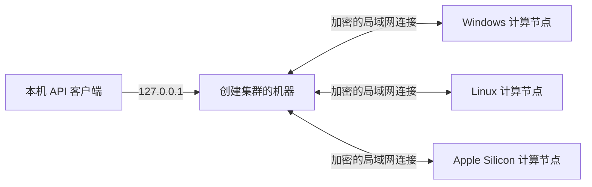

# IdleToken 使用指南

IdleToken 可以在一台受支持的电脑上运行大模型，也可以把同一局域网里的多台
Windows、Linux 和 macOS 电脑组成一个推理集群。启动后，它会提供 OpenAI 与
Anthropic 兼容 API。

[English version](user-guide.md)

本指南从安装开始，依次介绍账号、模型、局域网组网、算力分享、API 接入和常见排障。

## 目录

1. [确认设备要求](#1-确认设备要求)
2. [安装 IdleToken](#2-安装-idletoken)
3. [注册并登录](#3-注册并登录)
4. [运行第一个模型](#4-运行第一个模型)
5. [组建局域网集群](#5-组建局域网集群)
6. [分享闲置算力](#6-分享闲置算力)
7. [连接 Claude Code 与 API 客户端](#7-连接-claude-code-与-api-客户端)
8. [了解隐私边界](#8-了解隐私边界)
9. [排障](#9-排障)

## 1. 确认设备要求

### 计算节点

| 项目 | 要求 |
| --- | --- |
| Windows / Linux 显卡 | NVIDIA Turing / RTX 20 系或更新，物理显存至少 8 GiB |
| macOS | Apple Silicon，使用 Metal 与统一内存 |
| 驱动 | 受支持的 NVIDIA 驱动；无需单独安装 CUDA Toolkit |
| 磁盘 | 固态盘；每台计算节点都要能保存所选 GGUF 的完整副本 |
| 网络 | 多机运行时接入同一个局域网，建议使用千兆有线网络 |
| 版本 | 同一集群里的每台机器安装相同版本的 IdleToken |

AMD/Intel 显卡、纯 CPU 电脑和 Intel Mac 不能参与模型计算，但可以作为控制端。
不符合计算要求的设备不会自动改用 CPU 推理。

### 模型与上下文

- 客户端提供经过适配的模型列表，不接受任意本地模型路径或 Hugging Face 地址。
- 当前精选列表只包含文本生成模型，不支持图片输入。
- 默认上下文严格为 256K；模型支持时可显式选择 1M。启动时不会静默缩短所选窗口。
- “仅用本机”和“多台机器一起”两个入口都会显示。“多台机器一起”始终是默认主操作，
  界面不标注“推荐”。容量警告不会禁用任一入口；明确选择多机后也不会静默退回本机。
- 资源卡是启动前的估算。最终能否运行以启动时的检查结果为准。

## 2. 安装 IdleToken

从 [GitHub Releases](https://github.com/idletoken/IdleToken/releases/latest) 下载与你的系统
和 CPU 架构匹配的安装包。

| 系统 | 安装文件 |
| --- | --- |
| Windows x64 | `IdleToken_<版本>_x64-setup.exe` |
| Apple Silicon macOS | `IdleToken_<版本>_aarch64.dmg` |
| Debian / Ubuntu x86_64 | `IdleToken_<版本>_amd64.deb` |
| Debian / Ubuntu arm64 | `IdleToken_<版本>_arm64.deb` |
| RPM 系 Linux x86_64 | `IdleToken-<版本>-1.x86_64.rpm` |
| RPM 系 Linux arm64 | `IdleToken-<版本>-1.aarch64.rpm` |
| Arch Linux x86_64 | `idletoken-bin-<版本>-1-x86_64.pkg.tar.zst` |

源码支持与 Release 安装包分开发送。如果当前 Release 页面尚未列出 Arch 文件，说明该版本
还没有项目发布的 Arch 安装包；此时请按 README 的源码构建步骤操作。

### Windows

1. 下载并运行 NSIS `.exe`。
2. 安装包尚未使用 Authenticode 签名，SmartScreen 可能显示“Windows 已保护你的电脑”。
   先对照 Release 页面公布的 SHA-256：

   ```powershell
   Get-FileHash .\IdleToken_<版本>_x64-setup.exe -Algorithm SHA256
   ```

3. 摘要一致后，选择 **更多信息 → 仍要运行**。
4. 允许 Windows 防火墙提示。若自动添加规则失败，客户端日志会显示需要管理员执行的命令。

### macOS

1. 打开 `.dmg`，把 IdleToken 拖入“应用程序”。
2. 首次启动时，右键 IdleToken 并选择 **打开**。若仍被拦截，前往
   **系统设置 → 隐私与安全性 → 仍要打开**。
3. Apple Silicon Mac 可以参与计算；Intel Mac 只能作为控制端。

### Linux

Debian / Ubuntu：

```sh
# x86_64
sudo apt install ./IdleToken_<版本>_amd64.deb

# arm64
sudo apt install ./IdleToken_<版本>_arm64.deb
```

Fedora / RHEL / openSUSE：

```sh
# x86_64
sudo rpm -Uvh IdleToken-<版本>-1.x86_64.rpm

# arm64
sudo rpm -Uvh IdleToken-<版本>-1.aarch64.rpm
```

Arch Linux（x86_64）：

```sh
sudo pacman -U ./idletoken-bin-<版本>-1-x86_64.pkg.tar.zst
```

Linux 安装包已经包含所需的 CUDA 用户态运行库，只需要兼容的 NVIDIA 驱动。安装包要求
glibc 2.39 或更新版本；不满足时，包管理器会拒绝安装。Linux 发布流程支持 `.deb`、
`.rpm`，以及仅支持 x86_64 的 Arch Linux `.pkg.tar.zst`；只有实际出现在对应 Release
页面上的文件才已经发布。Arch Linux ARM 不属于正式发布目标；其他发行版需要从公开仓库构建。

IdleToken 没有应用内更新器。升级时下载新的原生安装包并覆盖安装。

## 3. 注册并登录

只使用一次性组网码建立私有局域网集群时，可以不注册。以下功能需要账号：

- 用同一账号自动发现自己的机器；
- 分享算力；
- 使用平台 API 或共享市场。

### 注册与验证邮箱

1. 打开 [idletoken.ai](https://idletoken.ai)，选择 **注册**。
2. 输入邮箱和至少 8 位密码。

   

3. 打开 `no-reply@idletoken.ai` 发来的验证邮件，并在 24 小时内点击链接。
4. 回到门户登录。

网站第一次打开时会根据浏览器首选语言显示中文或英文。登录后切换语言，选择会保存到
账号；验证邮件和密码重置邮件也会使用这个语言。

### 登录桌面客户端

在客户端点击账号入口，使用同一邮箱和密码登录。


登录用于账号身份、自动组网和平台功能。私有集群的推理仍在你的机器与局域网中进行。

## 4. 运行第一个模型

### 选择模型、精度和上下文

1. 打开 **集群** 页面。
2. 在“已选模型”一栏选择模型与精度。
3. 保持默认的 256K 上下文；模型支持时也可选择 1M。1M 通常需要更多显存或统一内存。
4. 查看资源卡。


- **可用**：客户端从当前机器或集群成员测得的可用资源。
- **需要（预估）**：模型权重、所选上下文和运行时开销的合计。
- MoE 模型在离散显卡上还可能显示“专家存储需要”的系统内存估算。

### 下载模型文件

若所选模型尚未准备好，点击 **下载权重**，等待下载和哈希校验完成。多机运行时，每台
计算节点都需要模型文件的完整副本。

### 选择本机或多机运行

- **创建集群** 是默认主操作，用于让多台机器共同承载模型；随后也可以让本机加入已有集群。
- 明确需要不经过局域网 RPC 的本机路径时，选择 **仅在本机运行**。

容量估算只会警告，不会禁用任一操作。启动时会针对所选的精确上下文做资源硬检查。
若显示 `[RESOURCE_INSUFFICIENT]` 及需要量、可用量，可以降低精度、在适用时从 1M 改为
256K、释放显存，或增加计算节点后重试。

### 聊天

状态变为 **就绪** 后，打开 **聊天** 并发送消息。


模型的思考内容显示在默认折叠的 **思考** 区域。当前精选列表与聊天输入框仅支持文本。

## 5. 组建局域网集群



### 组网前检查

每台计算节点都要：

1. 安装相同版本的 IdleToken。
2. 接入同一个真实局域网；不要让计算连接使用 Tailscale、VPN 或其他 overlay 地址。
3. 准备相同的模型、精度和上下文。
4. 完成模型文件下载与校验。

### 使用同一账号

每台机器登录同一个账号。在第一台机器上选择 **用账号创建集群**；在其他机器上选择
**自动加入同账号集群**。客户端会在当前局域网中寻找这个账号创建的集群，不需要组网码。

### 使用一次性组网码

1. 第一台机器选择 **创建集群**，复制组网码。
2. 其他机器选择 **加入集群**，输入组网码。
3. 确认成员列表出现所有预期机器。
4. 从创建方启动集群。

启动时会检查成员版本、模型文件和资源。如果某台机器没有准备好，客户端会指出对应成员和
原因。全部通过后，状态变为 **集群就绪**，页面显示本机 API 地址。

局域网发现只用于找到机器；配对凭据不会通过广播公开。计算节点之间的 RPC 连接使用
PSK-TLS 加密。

## 6. 分享闲置算力

分享算力是单独的选择，不会因为建立了私有集群而自动开启。

1. 登录客户端，并让模型达到 **就绪**。
2. 点击客户端右上角的 **打开分享**。
3. 等按钮变为 **分享中**。

   

4. 登录门户，打开 **我的集群**，确认服务显示为在线，并按需要管理定价。

   

关闭分享后，平台不会再把新任务发给这项服务；已经开始执行的任务会继续完成。若分享按钮
显示失败，打开错误详情或最近代理日志，按提示检查登录状态、客户端版本和网络。

## 7. 连接 Claude Code 与 API 客户端

### 本机 API

默认地址是 `http://127.0.0.1:8000`，只能从运行 IdleToken 的同一台机器访问。若你显式配置了
本机 API 令牌（例如通过 `IDLETOKEN_API_TOKEN`），请让调用方同时发送该令牌。

### Claude Code

```sh
export ANTHROPIC_BASE_URL=http://127.0.0.1:8000
export ANTHROPIC_API_KEY=idletoken
export NO_PROXY=127.0.0.1,localhost
claude
```

Claude Code 要求 `ANTHROPIC_API_KEY` 非空。未配置本机 API 令牌时，示例中的 `idletoken`
只是占位值；配置了令牌时，把它替换成真实值。

### OpenAI 兼容请求

```sh
curl http://127.0.0.1:8000/v1/chat/completions \
  -H 'content-type: application/json' \
  -d '{"model":"<模型 id>","messages":[{"role":"user","content":"你好"}],"max_tokens":128}'
```

### Anthropic 兼容请求

```sh
curl http://127.0.0.1:8000/v1/messages \
  -H 'content-type: application/json' \
  -d '{"model":"<模型 id>","max_tokens":128,"messages":[{"role":"user","content":"你好"}]}'
```

两套协议都支持流式响应。`GET /v1/models` 会返回这台协调者正在提供的模型。

### 平台 API

1. 登录门户。
2. 点击右上角头像，打开 **火花 → API 密钥**。
3. 点击 **新建密钥**，立即复制只显示一次的密钥。


```sh
curl https://api.idletoken.ai/v1/chat/completions \
  -H 'authorization: Bearer <你的密钥>' \
  -H 'content-type: application/json' \
  -d '{"model":"<模型名或模型名:精度>","messages":[{"role":"user","content":"你好"}]}'
```

平台调用会消耗账号中的火花。可用模型与精度以门户发现页或 `GET /catalog` 返回的在线服务
为准。

## 8. 了解隐私边界

- 私有局域网集群的跨机器计算连接使用 PSK-TLS；embedding 查表和第 0 层留在创建集群的
  机器上。
- 本机 API 只绑定 `127.0.0.1`，不对局域网开放。浏览器页面带 `Origin` 的请求会被拒绝，
  以防网页直接调用回环 API。
- 远程平台请求在传输途中使用加密信封，但平台可能为了路由、内容审核、滥用处理和计量
  处理明文。传输加密不表示平台无法读取提示词。
- 只把你信任的机器加入私有集群。加密链路不能保护你免受已经控制了参与节点的攻击者。

## 9. 排障

### 没有收到验证或重置邮件

1. 检查垃圾邮件和推广邮件。
2. 确认注册邮箱拼写正确。
3. 等页面显示的冷却时间结束后再重发一次。
4. 找到合法邮件后，将它标为“不是垃圾邮件”，帮助邮箱提供商记住你的选择。

### 机器找不到集群

1. 确认机器在同一个局域网，路由器没有开启 AP/客户端隔离。
2. 放行系统防火墙提示。
3. 关闭会接管局域网路由的 VPN，且不要使用 Tailscale 等 overlay 地址承载计算流量。
4. 确认每台机器安装相同版本。

### 模型无法启动

- 确认权重已经下载完成并通过校验。
- 根据资源卡和错误详情释放显存/内存，或选择更低精度；适用时可从 1M 改为 256K。
- 多机运行时，检查错误中点名的成员是否在线且配置一致。

### 加载长时间没有完成

大模型加载可能需要几分钟。打开引擎日志查看当前阶段；若卡片显示错误，先处理日志中的原因
再重试。提交问题时附上客户端版本、错误详情和对应日志。

### 流式回答结束后一直不返回

设置 `NO_PROXY=127.0.0.1,localhost`。Clash 等本机 HTTP 代理可能拦截回环 SSE 并吞掉
结束信号。

### Linux 窗口全白

先从终端启动一次：

```sh
WEBKIT_DISABLE_DMABUF_RENDERER=1 idletoken
```

若界面恢复正常，把这个环境变量加入桌面启动器。

### 第二条本机请求一直等待

本机推理一次处理一条请求，后续请求会排队。若已启用“请求外援”，IdleToken 会在请求留在
本地队列的同时寻找共享算力；没有外援时，请求会在本机槽位空闲后继续执行。可以在聊天界面
取消仍在等待的请求。
